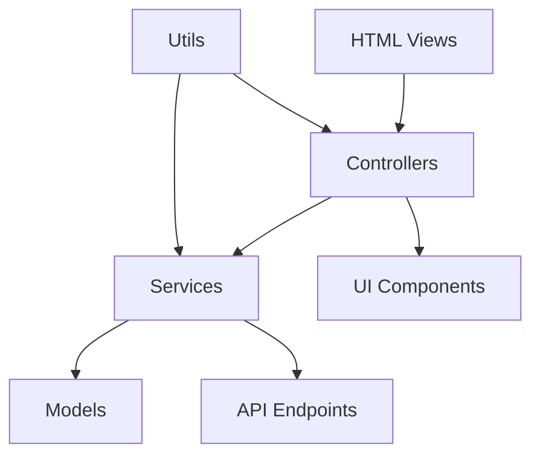

# 📋 DOCUMENTACIÓN DE PATRONES DE DISEÑO - iTaxCix Panel

## 🏗️ ARQUITECTURA GENERAL

Tu aplicación iTaxCix implementa una arquitectura **modular y escalable** basada en múltiples patrones de diseño bien establecidos.

---

## 📐 PATRONES DE DISEÑO IMPLEMENTADOS

### 1. **MVC (Model-View-Controller) Pattern** 🎯

**Estructura:**
```
📁 Models (Modelos de datos)
   └── assets/js/api/models/
       └── conductor.js

📁 Views (Vistas/Interfaz)
   └── HTML files + CSS styling
       ├── index.html
       ├── pages/usuarios/ControlAdmisionConductores.html
       └── assets/css/*.css

📁 Controllers (Controladores)
   └── assets/js/ui/controllers/
       ├── login-controller.js
       ├── password-recovery-controller.js
       ├── sidebar-controller.js
       ├── profile-controller.js
       ├── ui-controller.js
       └── app-initializer.js
```

**Implementación:**
- **Modelo:** `Conductor` maneja la lógica de datos y validaciones
- **Vista:** HTML/CSS para presentación visual
- **Controlador:** Maneja la lógica de interacción usuario-sistema

### 2. **Service Layer Pattern** 🔧

**Estructura:**
```
📁 Services (Capa de servicios)
   └── assets/js/api/services/
       ├── login-service.js          → Autenticación
       ├── conductor-service.js      → Gestión de conductores
       ├── password-recovery-service.js → Recuperación de contraseñas
       ├── profile-service.js        → Gestión de perfil de usuario
       └── mock-login-service.js     → Testing/Mocking
```

**Beneficios:**
- Separación de lógica de negocio
- Reutilización de código
- Facilita testing y mantenimiento

### 3. **Singleton Pattern** 🎯

**Implementación:**
```javascript
// Instancia única global de servicios
window.LoginService = new LoginService();
window.PasswordRecoveryService = new PasswordRecoveryService();
```

**Propósito:**
- Garantiza una sola instancia de servicios críticos
- Acceso global controlado

### 4. **Observer Pattern** 👁️

**Implementación:**
```javascript
// Event delegation y manejo de eventos DOM
document.addEventListener('DOMContentLoaded', function() {
    // Observadores de eventos de UI
});

// Observers para cambios de estado
window.addEventListener('pageshow', function(event) {
    // Observa cambios de navegación
});
```

### 5. **Factory Pattern** 🏭

**Implementación:**
```javascript
// En conductor.js
class Conductor {
    static fromApiData(apiData) {
        // Factory method para crear instancias desde API
        return new Conductor(apiData);
    }
}
```

### 6. **Strategy Pattern** 🎲

**Implementación:**
```javascript
// En login-service.js - Múltiples estrategias de fetch
class LoginService {
    async authenticateUser(credentials) {
        // Estrategia 1: Fetch normal
        // Estrategia 2: Fetch con SSL fallback
        // Estrategia 3: Retry con diferentes configuraciones
    }
}
```

### 7. **Module Pattern** 📦

**Estructura:**
```
assets/js/
├── api/          → Módulo de API
├── ui/           → Módulo de UI
├── utils/        → Módulo de utilidades
└── lib/          → Módulo de librerías
```

### 8. **Facade Pattern** 🎭

**Implementación:**
```javascript
// Controllers actúan como facades
class LoginController {
    // Simplifica la interacción entre UI y servicios
    handleLogin() {
        // Facade que coordina múltiples subsistemas
    }
}
```

---

## 🔗 ESTRUCTURA DE DEPENDENCIAS



---

## 📊 BENEFICIOS DE LA ARQUITECTURA

### ✅ **Separación de Responsabilidades**
- Cada módulo tiene una responsabilidad específica
- Código más mantenible y testeable

### ✅ **Reutilización de Código**
- Servicios reutilizables
- Componentes modulares

### ✅ **Escalabilidad**
- Fácil agregar nuevos módulos
- Estructura extensible

### ✅ **Testing**
- Componentes aislados
- Mock services disponibles

### ✅ **Mantenibilidad**
- Código organizado
- Dependencias claras

---

## 🚀 PATRONES ADICIONALES IDENTIFICADOS

### **Error Handling Pattern**
```javascript
// Manejo consistente de errores en servicios
try {
    // Operación
} catch (error) {
    // Logging y manejo centralizado
}
```

### **Configuration Pattern**
```javascript
// Configuraciones centralizadas
const API_CONFIG = {
    baseUrl: 'https://149.130.161.148',
    timeout: 10000,
    retryAttempts: 3
};
```

### **Authentication Guard Pattern**
```javascript
// En route-guard.js y auth-checker.js
// Protección de rutas y verificación de autenticación
```

---

## 📝 CONCLUSIÓN

Tu aplicación iTaxCix implementa una **arquitectura sólida y profesional** que combina múltiples patrones de diseño para crear un sistema:

- **Modular** y **escalable**
- **Mantenible** y **testeable**  
- **Robusto** ante errores
- **Siguiendo mejores prácticas** de desarrollo

Esta estructura facilita el desarrollo colaborativo, el mantenimiento a largo plazo y la extensión de funcionalidades.

---

*Documentación generada el 8 de junio de 2025*
